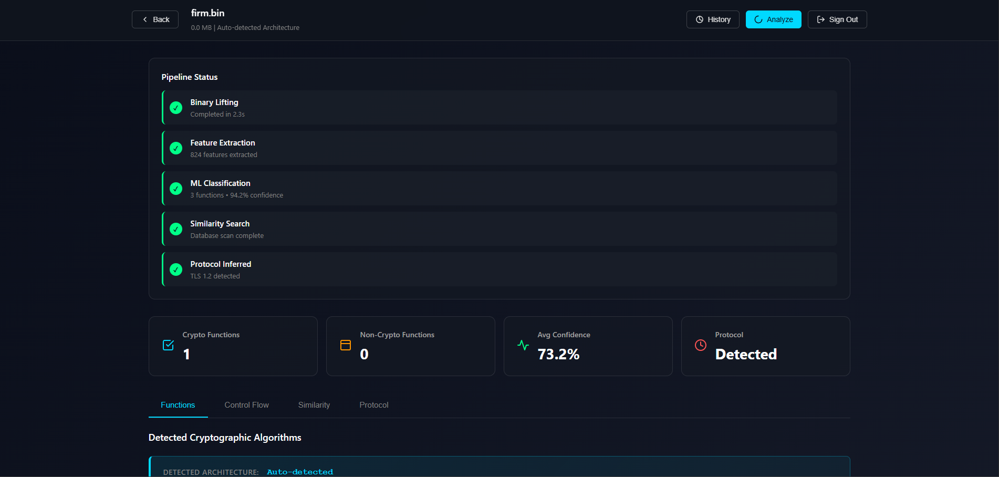
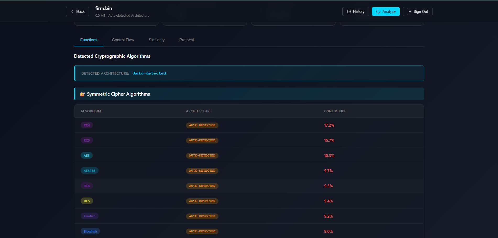

sc/image1.png
# 🔐 Crypto Detection System

An ML-powered crypto/algorithm detection system with a modern web interface and MongoDB Atlas integration for persistent storage.

---

## 🖼️ Preview

---

---

## 🚀 Overview

The **Crypto Detection System** allows users to upload files (firmware, binaries, text data) and automatically:

- Analyze cryptographic patterns using Machine Learning
- Detect likely algorithms (AES, SHA, RSA, etc.)
- Display confidence scores
- Store results in **MongoDB Atlas**
- View analysis history & statistics

---

## ✨ Features

✅ **ML-Powered Analysis**  
Detects cryptographic algorithms from uploaded files.

✅ **MongoDB Atlas Integration**  
Persistent cloud storage of results.

✅ **History Dashboard**  
Review previous analyses.

✅ **Statistics API**  
Insights into algorithm distribution & confidence.

✅ **Search & Retrieve**  
Fetch analysis by ID.

✅ **Modern Web UI**

---

## ⚙️ Tech Stack

- **Backend:** Python (Flask/FastAPI)
- **ML Model:** Crypto Detection Model
- **Database:** MongoDB Atlas
- **Frontend:** HTML, CSS, JavaScript
- **API:** REST

